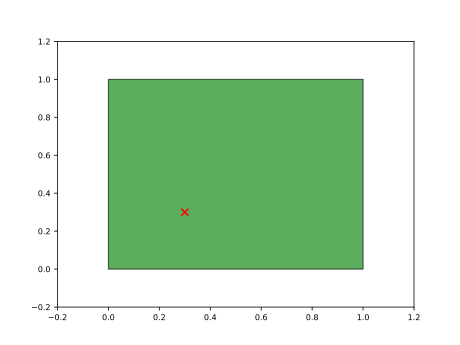
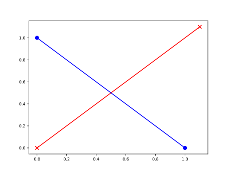
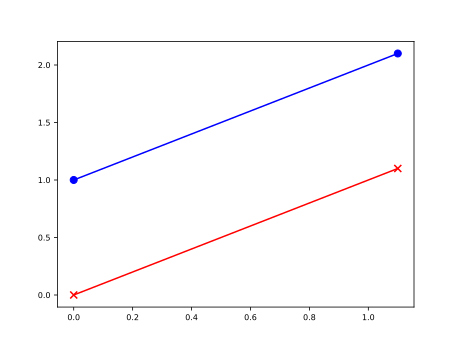
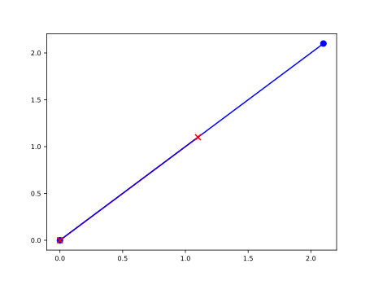
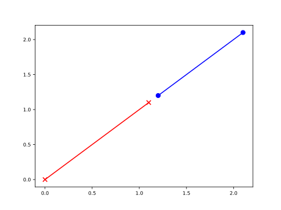

|GitHub version|  |Licence GPLv2| |Python version| |OS|

.. |GitHub version| image:: https://img.shields.io/badge/version-0.2.0.dev0-yellow.svg
   :target: https://github.com/Naereen/StrapDown.js

.. |Python version| image:: https://img.shields.io/badge/python-3.6|3.7|3.8-orange.svg
   :target: https://github.com/Naereen/StrapDown.js

.. |Licence GPLv2| image:: https://img.shields.io/badge/license-MIT-blue.svg
   :target: https://github.com/Naereen/StrapDown.js

.. |OS| image:: https://img.shields.io/badge/os-Linux|Windows|macOS-magenta.svg
   :target: https://github.com/Naereen/StrapDown.js

.. _example_scripts: https://github.com/mikecokina/elisa/tree/master/scripts/analytics

Pypex
=====

**Pypex** is python library created for purpose of easier interactions with 2D convex polygons and lines.
It gives you a strong and simple tool if you need determine properties such as surface areas of polygons
defined by points, find if two lopygons intersects each other or determine polygon in which other two defined
polygons intersects.

Examples
--------

In this sections are shown several examples of `pypex` usage.

Point vs Polygon interaction
~~~~~~~~~~~~~~~~~~~~~~~~~~~~

**[In]**

.. code-block:: python

    from pypex import Polygon, Point

    point = Point(0.3, 0.3)
    polygon = Polygon([[0.0, 0.0], [1.0, 0.0], [0.0, 1.0], [1.0, 1.0]])
    in_poly = point.is_inside_polygon(polygon)
    print(f"{point} is inside polygon: {in_poly}")

**[Out]**::

    Point [0.3, 0.3] is inside polygon: True

Point properties
~~~~~~~~~~~~~~~~

**[In]**

.. code-block:: python

    from pypex import Polygon, Point

    point = Point(0.3, 0.3)
    pnt_array = point.to_array()
    print(f"Point as numpy array {pnt_array}")

**[Out]**::

    Point as numpy array [0.3 0.3]

**[In]**

.. code-block:: python

    pnt_list = point.to_list()
    print(f"Point as python list {pnt_list}")

**[Out]**::

    Point as python list [0.3, 0.3]

**[In]**

.. code-block:: python

    points = [Point(0.3456111, 0.3123), Point(0.3456, 0.3123)]
    set_tol3 = Point.set(points, round_tol=3)
    print(f"Points {points} define following set with tolerance 3: {set_tol3}"))

**[Out]**::

    Points [Point [0.3456111, 0.3123], Point [0.3456, 0.3123]] define following set with tolerance 3: [Point [0.3456111, 0.3123]]

**[In]**

.. code-block:: python

    set_tol9 = Point.set(points, round_tol=9)
    print("Points {points} define following set with tolerance 9: {set_tol9}")

**[Out]**::

    Points [Point [0.3456111, 0.3123], Point [0.3456, 0.3123]] define following set with tolerance 9: [Point [0.3456111, 0.3123] Point [0.3456, 0.3123]]

Line vs Line interaction
~~~~~~~~~~~~~~~~~~~~~~~~

**[In]**

.. code-block:: python

    line1 = Line([[0.0, 0.0], [1.1, 1.1]])
    line2 = Line([[0.0, 1.0], [1.0, 0.0]])

    intersects = line1.intersects(line2)
    print(f"{line1} is in intersection with {line2}: {intersects}")

**[Out]**::

    Line: [[0. 0.], [1.1 1.1]] is in intersection with Line: [[0. 1.], [1. 0.]]: True

**[In]**

.. code-block:: python

    intersection = line1.intersection(line2)
    print(f"{line1} intersects {line2} in {intersection}")

**[Out]**::

    Line: [[0. 0.], [1.1 1.1]] intersects Line: [[0. 1.], [1. 0.]] in Point [0.5, 0.5]

**[In]**

.. code-block:: python

    # full output
    full = line1.intersects(line2, _full=True)
    print("full info of intersection of {} and {}\n"
          "     defined infinite lines intersects: {}\n"
          "     defined segments intersects: {}\n"
          "     defined segments intersects in {}\n"
          "     defined segments distance {}\n"
          "     defined segments description {}\n"
          "".format(line1, line2, full[0], full[1], full[2], full[3], full[4]))

**[Out]**::

    full info of intersection of Line: [[0. 0.], [1.1 1.1]] and Line: [[0. 1.], [1. 0.]]
        defined infinite lines intersects: True
        defined segments intersects: True
        defined segments intersects in Point [0.5, 0.5]
        defined segments distance nan
        defined segments description INTERSECT

**[In]**

.. code-block:: python

    line1 = Line([[0.0, 0.0], [1.1, 1.1]])
    line2 = Line([[0.0, 1.0], [1.1, 2.1]])
    full = line1.intersects(line2, _full=True)
    print("full info of intersection of {} and {}\n"
          "     defined infinite lines intersects: {}\n"
          "     defined segments intersects: {}\n"
          "     defined segments intersects in {}\n"
          "     defined segments distance {}\n"
          "     defined segments description {}\n"
          "".format(line1, line2, full[0], full[1], full[2], full[3], full[4]))

**[Out]**::

    full info of intersection of Line: [[0. 0.], [1.1 1.1]] and Line: [[0. 1.], [1.1 2.1]]
        defined infinite lines intersects: False
        defined segments intersects: False
        defined segments intersects in nan
        defined segments distance 0.7071067811865476
        defined segments description PARALLEL

**[In]**

.. code-block:: python

    line1 = Line([[0.0, 0.0], [1.1, 1.1]])
    line2 = Line([[0.0, 0.0], [2.1, 2.1]])
    full = line1.intersects(line2, _full=True)
    print("full info of intersection of {} and {}\n"
          "     defined infinite lines intersects: {}\n"
          "     defined segments intersects: {}\n"
          "     defined segments intersects in {}\n"
          "     defined segments distance {}\n"
          "     defined segments description {}\n"
          "".format(line1, line2, full[0], full[1], full[2], full[3], full[4]))

**[Out]**::

    full info of intersection of Line: [[0. 0.], [1.1 1.1]] and Line: [[0. 0.], [2.1 2.1]]
        defined infinite lines intersects: True
        defined segments intersects: True
        defined segments intersects in nan
        defined segments distance 0.0
        defined segments description OVERLAP

**[In]**

.. code-block:: python

    line1 = Line([[0.0, 0.0], [1.1, 1.1]])
    line2 = Line([[1.2, 1.2], [2.1, 2.1]])
    full = line1.intersects(line2, _full=True)
    print("full info of intersection of {} and {}\n"
          "     defined infinite lines intersects: {}\n"
          "     defined segments intersects: {}\n"
          "     defined segments intersects in {}\n"
          "     defined segments distance {}\n"
          "     defined segments description {}\n"
          "".format(line1, line2, full[0], full[1], full[2], full[3], full[4]))

**[Out]**::

    full info of intersection of Line: [[0. 0.], [1.1 1.1]] and Line: [[1.2 1.2], [2.1 2.1]]
        defined infinite lines intersects: True
        defined segments intersects: False
        defined segments intersects in nan
        defined segments distance 0.0
        defined segments description OVERLAP

